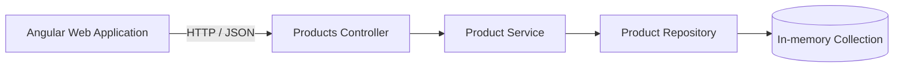

# 🏪 StoreHouse

[


![GitHub Actions](https://img.shields.io/badge/GitHublogo=githubactions&logoColor=white

A full-stack product catalog application built with ASP.NET Core Web API and Angular.

---

## 📖 Overview

StoreHouse is a recruitment project demonstrating a clean and maintainable approach to building a small full-stack application.

The application allows users to:

- display the product catalog,
- add new products,
- validate product data,
- communicate with a REST API,
- test backend business logic,
- verify the build automatically using GitHub Actions.

---

## ✨ Features

### Backend

- REST API implemented with ASP.NET Core
- Retrieve all products
- Add a new product
- In-memory product repository
- Dependency Injection
- Service and Repository layers
- Request validation with FluentValidation
- Global exception handling
- Swagger UI and OpenAPI documentation
- CORS configuration for the Angular application

### Frontend

- Product list
- Product creation form
- Reactive Forms
- Client-side validation
- REST API communication
- Loading and error handling
- Responsive user interface

### Quality

- Unit tests with xUnit
- Test doubles with Moq
- Readable assertions with FluentAssertions
- Continuous Integration with GitHub Actions
- Shared code formatting rules with `.editorconfig`

---

## 🧰 Technology Stack

### Backend

| Technology | Purpose |
|---|---|
| .NET 8 | Application platform |
| ASP.NET Core | REST API |
| FluentValidation | Request validation |
| Swagger / OpenAPI | API documentation |
| In-memory repository | Product storage |

### Frontend

| Technology | Purpose |
|---|---|
| Angular | Frontend framework |
| TypeScript | Application language |
| Reactive Forms | Form handling and validation |
| RxJS | Asynchronous API communication |

### Tests and automation

| Technology | Purpose |
|---|---|
| xUnit | Unit test framework |
| Moq | Mocking dependencies |
| FluentAssertions | Readable test assertions |
| GitHub Actions | Automated build and test pipeline |

---

## 📂 Project Structure

```text
MediaExpertTask/
│
├── StoreHouse.Api/
│   ├── Controllers/
│   ├── DTOs/
│   ├── Middleware/
│   ├── Models/
│   ├── Repositories/
│   ├── Services/
│   ├── Validators/
│   ├── Program.cs
│   ├── StoreHouse.Api.csproj
│   └── StoreHouse.sln
│
├── StoreHouse.Tests/
│   ├── Services/
│   ├── Validators/
│   └── StoreHouse.Tests.csproj
│
├── StoreHouse.Web/
│   ├── src/
│   ├── angular.json
│   ├── package.json
│   ├── package-lock.json
│   └── tsconfig.json
│
├── .github/
│   └── workflows/
│       └── build.yml
│
├── .editorconfig
├── .gitignore
└── README.md
```

---

## 🏗️ Architecture



### Responsibilities

- **Controller** handles HTTP requests and responses.
- **Service** contains application and business logic.
- **Repository** provides access to stored products.
- **DTOs** define the public API contract.
- **Validators** verify incoming product data.
- **Middleware** provides consistent exception handling.

---

## 🚀 Getting Started

### Prerequisites

Install:

- .NET 8 SDK
- Node.js
- npm
- Angular CLI
- Git

Clone the repository:

```bash
git clone https://github.com/quadrigis/mediaExpertTask.git
cd mediaExpertTask
```

---

## ⚙️ Running the Backend

Restore dependencies:

```bash
dotnet restore StoreHouse.Api/StoreHouse.sln
```

Build the solution:

```bash
dotnet build StoreHouse.Api/StoreHouse.sln
```

Run the API:

```bash
dotnet run --project StoreHouse.Api/StoreHouse.Api.csproj
```

The terminal displays the HTTP and HTTPS addresses assigned to the application.

---

## 📖 Swagger UI

After starting the backend, open the API address with the `/swagger` path.

Example:

```text
https://localhost:7001/swagger
```

The actual port is defined by the local launch configuration and may differ.

Swagger UI allows the API endpoints to be inspected and tested directly from a browser.

---

## 🔌 API Endpoints

### Get all products

```http
GET /api/products
```

Example response:

```json
[
  {
    "id": "2bf8f425-2780-4ea1-a99d-16f93d19d497",
    "code": "MON-001",
    "name": "Monitor 27 inches",
    "price": 1299.99
  }
]
```

### Create a product

```http
POST /api/products
Content-Type: application/json
```

Example request:

```json
{
  "code": "KEY-001",
  "name": "Mechanical keyboard",
  "price": 349.99
}
```

Example response:

```json
{
  "id": "4aa750ef-8015-4acc-9e8f-9c557c999c68",
  "code": "KEY-001",
  "name": "Mechanical keyboard",
  "price": 349.99
}
```

### Response statuses

| Status | Meaning |
|---|---|
| `200 OK` | Products returned successfully |
| `201 Created` | Product created successfully |
| `400 Bad Request` | Product validation failed |
| `500 Internal Server Error` | Unexpected application error |

---

## ✅ Validation

Product requests are validated using FluentValidation.

| Field | Rules |
|---|---|
| `code` | Required, maximum 50 characters |
| `name` | Required, maximum 200 characters |
| `price` | Must be greater than zero |

Example of an invalid request:

```json
{
  "code": "",
  "name": "",
  "price": -10
}
```

The API returns:

```http
400 Bad Request
```

together with validation details.

---

## 💾 In-memory Storage

Products are stored in application memory.

This means that:

- no external database is required,
- products remain available while the API process is running,
- all added products are removed after restarting the API.

The repository is registered as a singleton so that the same collection is used across HTTP requests:

```csharp
builder.Services.AddSingleton<
    IProductRepository,
    InMemoryProductRepository>();
```

---

## 🖥️ Running the Frontend

Install dependencies:

```bash
cd StoreHouse.Web
npm ci
```

Start the development server:

```bash
npm start
```

Alternatively:

```bash
ng serve
```

Open the Angular application:

```text
http://localhost:4200
```

---

## 🧪 Running Tests

From the repository root, execute:

```bash
dotnet test StoreHouse.Tests/StoreHouse.Tests.csproj
```

The unit tests cover:

- product creation,
- product mapping,
- product retrieval,
- repository interaction,
- request validation,
- invalid product prices,
- required product fields.

---

## 🔄 Continuous 