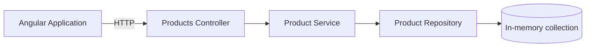

# 🛒 Product Catalog

r](https://img.shields.io/badge/Angular-Frontend-DD0031?style=for-the-badge&logo=angular&logoColorST API](https://img.shields.io/badge/API-REST-009688?style=for-the-badge)
![Swagger](https://img.shields.io/badge/OpenAPI-Swagger-85r-the-badge&logo=swagger&logoColor=ense](https://img.shields.io/badge/-blue?style=for-the-badge

A simple full-stack product catalog application built with **ASP.NET Core Web API** and **Angular**.

The application allows users to:

- 📋 display the product catalog,
- ➕ add a new product,
- ✅ validate entered data,
- 🔗 communicate between the Angular application and REST API.

---

## ✨ Features

### Backend

- REST API implemented with ASP.NET Core
- Product list endpoint
- Product creation endpoint
- In-memory repository
- Dependency Injection
- Request validation with FluentValidation
- Global exception handling
- Swagger UI / OpenAPI documentation
- CORS configuration for the Angular application

### Frontend

- Product list
- Product creation form
- Reactive Forms
- Client-side validation
- API communication
- Loading and error handling
- Responsive user interface

---

## 🧰 Technology stack

### Backend

| Technology | Purpose |
|---|---|
| .NET 8 | Application platform |
| ASP.NET Core | REST API |
| FluentValidation | Request validation |
| Swagger / OpenAPI | API documentation |
| In-memory repository | Product storage |

### Frontend

| Technology | Purpose |
|---|---|
| Angular | Frontend framework |
| TypeScript | Application language |
| Reactive Forms | Form handling and validation |
| Angular Material | User interface components |
| RxJS | Asynchronous API communication |

---

## 🏗️ Architecture

The backend uses a simple layered architecture:



### Responsibilities

- **Controller** handles HTTP requests and responses.
- **Service** contains application and business logic.
- **Repository** provides access to stored products.
- **DTOs** define the public API contract.
- **Validators** verify incoming request data.
- **Middleware** provides consistent exception handling.

---

## 📁 Project structure

```text
product-catalog/
│
├── backend/
│   └── ProductCatalog.Api/
│       ├── Controllers/
│       │   └── ProductsController.cs
│       ├── DTOs/
│       │   ├── CreateProductRequest.cs
│       │   └── ProductResponse.cs
│       ├── Middleware/
│       │   └── ExceptionMiddleware.cs
│       ├── Models/
│       │   └── Product.cs
│       ├── Repositories/
│       │   ├── IProductRepository.cs
│       │   └── InMemoryProductRepository.cs
│       ├── Services/
│       │   ├── IProductService.cs
│       │   └── ProductService.cs
│       ├── Validators/
│       │   └── CreateProductRequestValidator.cs
│       ├── Properties/
│       │   └── launchSettings.json
│       ├── appsettings.json
│       ├── ProductCatalog.Api.csproj
│       └── Program.cs
│
├── frontend/
│   └── product-catalog-ui/
│
├── .gitignore
├── LICENSE
└── README.md
```

---

## 🚀 Getting started

### Prerequisites

Install the following tools:

- .NET 8 SDK
- Node.js
- Angular CLI
- Git

---

## ⚙️ Running the backend

Navigate to the API project:

```bash
cd backend/ProductCatalog.Api
```

Restore dependencies:

```bash
dotnet restore
```

Run the application:

```bash
dotnet run
```

The terminal will display the local application addresses.

Typical development addresses are:

```text
https://localhost:7001
http://localhost:5001
```

> The actual ports are defined in `Properties/launchSettings.json` and may be different on your machine.

---

## 📖 API documentation

After starting the backend, open Swagger UI using the address displayed in the terminal with the `/swagger` path.

Example:

```text
https://localhost:7001/swagger
```

Swagger UI allows you to inspect and test the available API endpoints directly from the browser.

---

## 🔌 API endpoints

### Get all products

```http
GET /api/products
```

Example response:

```json
[
  {
    "id": "2bf8f425-2780-4ea1-a99d-16f93d19d497",
    "code": "MON-001",
    "name": "Monitor 27 inches",
    "price": 1299.99
  }
]
```

### Create a product

```http
POST /api/products
Content-Type: application/json
```

Example request:

```json
{
  "code": "KEY-001",
  "name": "Mechanical keyboard",
  "price": 349.99
}
```

Example response:

```json
{
  "id": "4aa750ef-8015-4acc-9e8f-9c557c999c68",
  "code": "KEY-001",
  "name": "Mechanical keyboard",
  "price": 349.99
}
```

Possible response statuses:

| Status | Meaning |
|---|---|
| `200 OK` | Products returned successfully |
| `201 Created` | Product created successfully |
| `400 Bad Request` | Request validation failed |
| `500 Internal Server Error` | Unexpected application error |

---

## ✅ Validation

A product must satisfy the following rules:

| Field | Rules |
|---|---|
| `code` | Required, maximum 50 characters |
| `name` | Required, maximum 200 characters |
| `price` | Must be greater than zero |

Example of an invalid request:

```json
{
  "code": "",
  "name": "",
  "price": -10
}
```

The API returns `400 Bad Request` together with validation details.

---

## 🧠 In-memory storage

Products are stored in the application memory.

This means that:

- no external database is required,
- products are available while the API process is running,
- all added products are removed after restarting the application.

The repository is registered as a singleton so that the same in-memory collection is used across HTTP requests.

```csharp
builder.Services.AddSingleton<
    IProductRepository,
    InMemoryProductRepository>();
```

---

## 🌐 CORS configuration

The API allows requests from the Angular development server.

Example development policy:

```csharp
builder.Services.AddCors(options =>
{
    options.AddPolicy("AngularClient", policy =>
    {
        policy
            .WithOrigins("http://localhost:4200")
            .AllowAnyHeader()
            .AllowAnyMethod();
    });
});
```

For this application, a specific Angular origin is preferred over `AllowAnyOrigin()`.

---

## 🖥️ Running the frontend

Navigate to the Angular project:

```bash
cd frontend/product-catalog-ui
```

Install dependencies:

```bash
npm install
```

Run the application:

```bash
ng serve
```

Open the address displayed by Angular CLI in your browser. The default development address is usually:

```text
http://localhost:4200
```

---

## 🧪 Running tests

### Backend tests

```bash
dotnet test
```

### Frontend tests

```bash
ng test
```

> If automated tests are not included yet, remove this section instead of presenting unimplemented tests as available.

---

## 💡 Design decisions

### Why DTOs?

DTOs separate the public API contract from the internal domain model. They also prevent internal model changes from unintentionally affecting API clients.

### Why a service layer?

The service layer separates application logic from HTTP-related controller responsibilities and makes the behavior easier to test.

### Why an in-memory repository?

It fulfills the task requirements while keeping the application focused on API design, validation, architecture and frontend integration.

### Why FluentValidation?

It keeps validation rules separate from request models and provides readable, testable validation logic.

### Why no database?

Persistent storage is outside the scope of this task. The repository abstraction makes it possible to introduce a database implementation later without changing controllers.

---

## 🔮 Possible improvements

Given a larger application scope, the following features could be added:

- editing and deleting products,
- pagination and filtering,
- persistent database storage,
- duplicate product-code validation,
- structured application logging,
- automated integration tests,
- Docker support,
- CI workflow,
- authentication and authorization.

---

## 📸 